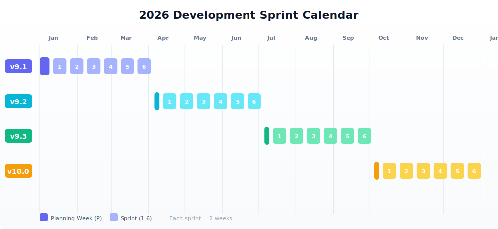

# 2026

This page outlines the BHoM development sprint schedule for 2026. Our development cycle follows a quarterly release cadence with six two-week sprints per quarter, preceded by a planning week.

---

## Release Schedule Overview

| Release | Planning Week | Sprint Period | Beta Release |
|---------|--------------|---------------|--------------|
| **v9.1** | Dec 29, 2025 – Jan 9 | Jan 12 – Apr 3 | April 2026 |
| **v9.2** | Apr 6 – Apr 10 | Apr 13 – Jul 3 | July 2026 |
| **v9.3** | Jul 6 – Jul 10 | Jul 13 – Oct 2 | October 2026 |
| **v10.0** | Oct 5 – Oct 9 | Oct 12 – Jan 1, 2027 | January 2027 |

---

## Q1 2026 — Release v9.1

**Planning Week:** December 29, 2025 – January 9, 2026

| Sprint | Start | End |
|--------|-------|-----|
| Sprint 1 | Jan 12 | Jan 23 |
| Sprint 2 | Jan 26 | Feb 6 |
| Sprint 3 | Feb 9 | Feb 20 |
| Sprint 4 | Feb 23 | Mar 6 |
| Sprint 5 | Mar 9 | Mar 20 |
| Sprint 6 | Mar 23 | Apr 3 |

---

## Q2 2026 — Release v9.2

**Planning Week:** April 6 – April 10, 2026

| Sprint | Start | End |
|--------|-------|-----|
| Sprint 1 | Apr 13 | Apr 24 |
| Sprint 2 | Apr 27 | May 8 |
| Sprint 3 | May 11 | May 22 |
| Sprint 4 | May 25 | Jun 5 |
| Sprint 5 | Jun 8 | Jun 19 |
| Sprint 6 | Jun 22 | Jul 3 |

---

## Q3 2026 — Release v9.3

**Planning Week:** July 6 – July 10, 2026

| Sprint | Start | End |
|--------|-------|-----|
| Sprint 1 | Jul 13 | Jul 24 |
| Sprint 2 | Jul 27 | Aug 7 |
| Sprint 3 | Aug 10 | Aug 21 |
| Sprint 4 | Aug 24 | Sep 4 |
| Sprint 5 | Sep 7 | Sep 18 |
| Sprint 6 | Sep 21 | Oct 2 |

---

## Q4 2026 — Release v10.0

**Planning Week:** October 5 – October 9, 2026

| Sprint | Start | End |
|--------|-------|-----|
| Sprint 1 | Oct 12 | Oct 23 |
| Sprint 2 | Oct 26 | Nov 6 |
| Sprint 3 | Nov 9 | Nov 20 |
| Sprint 4 | Nov 23 | Dec 4 |
| Sprint 5 | Dec 7 | Dec 18 |
| Sprint 6 | Dec 21 | Jan 1, 2027 |

---

## Sprint Cadence

Each development cycle follows a consistent structure:

- **Planning Week** — Backlog refinement, sprint planning, and alignment across teams
- **Sprints 1–6** — Two-week development sprints with defined deliverables
- **Beta Release** — End of cycle release for testing and validation

All sprints run Monday through Friday. Sprint boundaries align to facilitate coordination across our global contributor network.

---

## Questions?

For questions about the development schedule or contributing to an upcoming sprint, reach out via the [BHoM Slack](https://join.slack.com/t/bhom/shared_invite/) or open a discussion on [GitHub](https://github.com/BHoM/BHoM/discussions).
