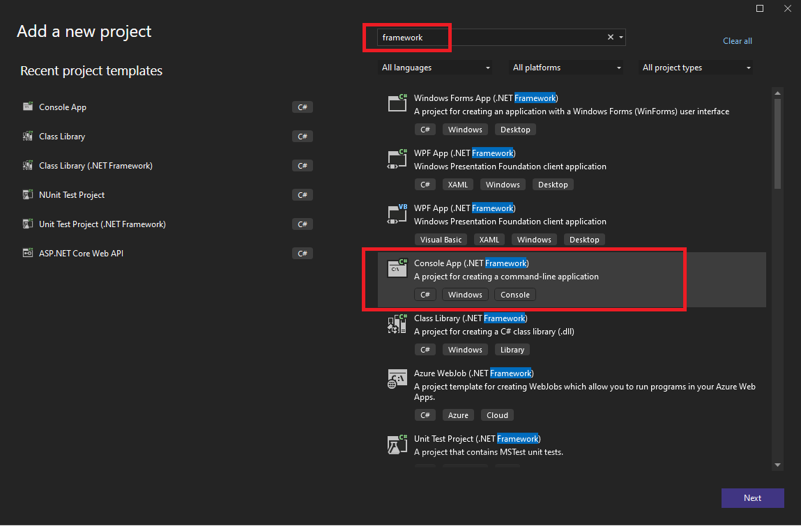
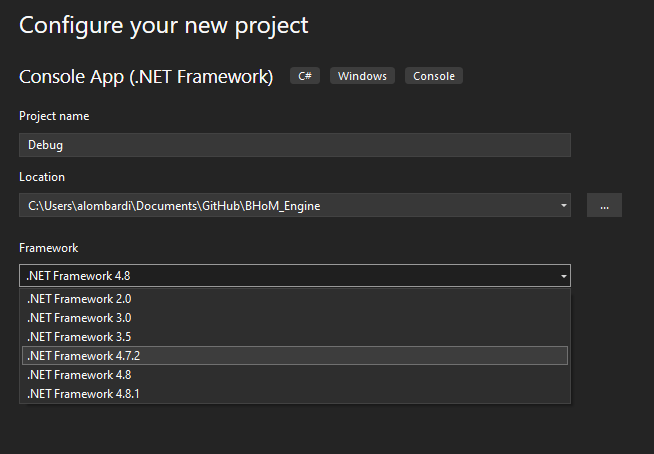
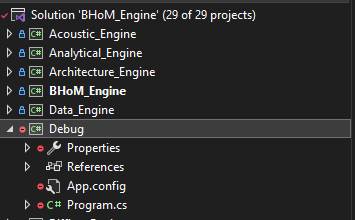
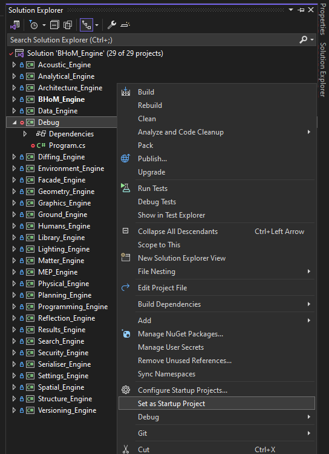
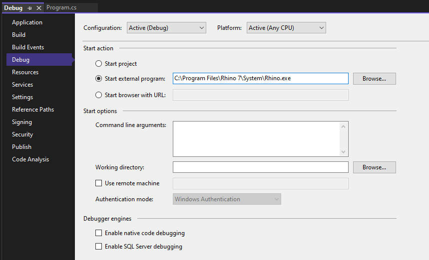

# BHoM Debugging and Edit-and-continue

When developing a Toolkit, you may want to Debug the code you've written, or even use the [Edit-and-continue feature](https://learn.microsoft.com/en-us/visualstudio/debugger/edit-and-continue-visual-csharp?view=vs-2022) that is available in many IDEs (mainly, Visual Studio). In particular, Edit-and-continue can be very useful in reducing rebuild iterations.

## Standard debugging

Simply [fire up your UI application and attach to its process](https://docs.microsoft.com/en-us/visualstudio/debugger/attach-to-running-processes-with-the-visual-studio-debugger?view=vs-2019#BKMK_Attach_to_a_running_process).

This way you will be able to follow code execution and check exceptions; however, this does not allow for code modification while debugging.

## Enabling Edit-and-continue

The [Edit-and-continue feature](https://learn.microsoft.com/en-us/visualstudio/debugger/edit-and-continue-visual-csharp?view=vs-2022) allows you to do code modifications without having to close the UI (e.g. Rhino/Grasshopper or Excel) and rebuilding the Solution.

### Edit-and-continue for Rhino/Grasshopper

In a nutshell, to enable Edit-and-continue at least from a Rhino/Grasshopper process, you need to create a temporary (possibly [`.gitignore`d](https://git-scm.com/docs/gitignore)) project that uses the latest .NET Framework version compatible with Rhino (any 4.7, and possibly later, should work), setting that up as the "Startup project", and configured in its Debug options to launch the Rhino executable. Starting this Project will launch the debugger attached to a new instance of Rhino, in which the Edit-and-continue will work.

Note that _not all IDEs support this_ (notably, not the Express editions of Visual Studio – only the Community, Professional and Enterprise ones do).

Step by step instructions:

1. **Add a .NET Framework Console App to your Solution (e.g. your Toolkit)**. To add it:

    1.1 Right-click on the solution in the Solution Explorer, select Add, New Project:  
    

    1.2 Search for "framework" and select "Console App" showing ".NET Framework" in the description:  
    

    1.3 Call the new project "Debug" (this is useful to avoid tracking this project with git, as it gets excluded via the [`.gitignore`](https://git-scm.com/docs/gitignore)). Then, select a .NET 4.7 version for the framework. The specific version may vary depending on what you have installed on your machine, and what the currently installed Rhino version supports. Generally, any 4.7 subversion should be available and working, but higher versions (e.g. 4.8) may work as well. Click Create when done.  
    

    1.5 You will end up with this project (if you have a red icon, it indicates that it is untracked by git, as it should be).  
    

2. **Right-click the newly created Project, then select "Set as startup project"**. The project name will now be displayed in **bold**.  
   

3. **Configure the project to start with an UI application attached**. For Rhino/Grasshopper:
   
      3.1 Go in the project settings by right-clicking the Project and selecting "Properties".

      3.2 Go in the "Debug" section on the left, then select the "Start external program" radio button and specify the Rhino executable path (as found on your machine - check where it's located and copy its path) in the textbox.

      

4. **Start the debugger with new instance of the UI software attached** (e.g Rhino).  
   Press F5 or the big green "play" button at the top to start Rhino; this instance of Rhino will have the debugger already attached and the Edit-and-Continue feature enabled.

The last step will fire up your UI application and you will be able to modify the code while debugging (just press the `Pause` button in Visual Studio). **The Edit-and-Continue will be working for all the code in the Solution**.

