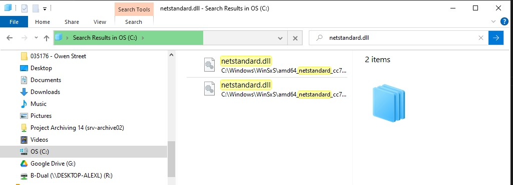
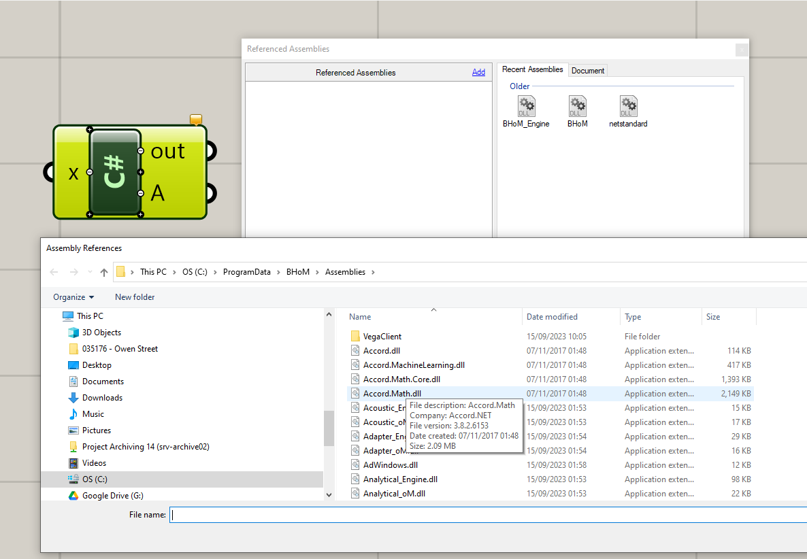
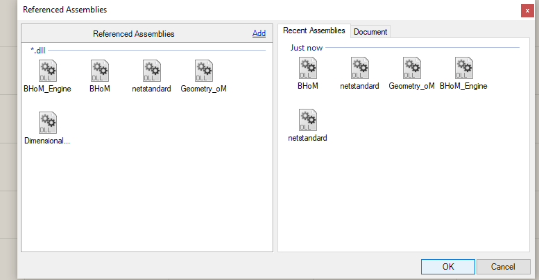
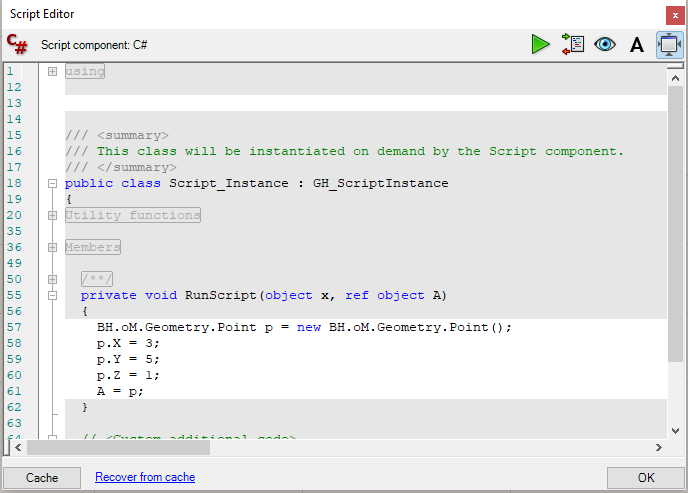
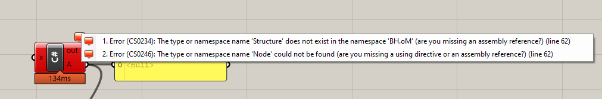
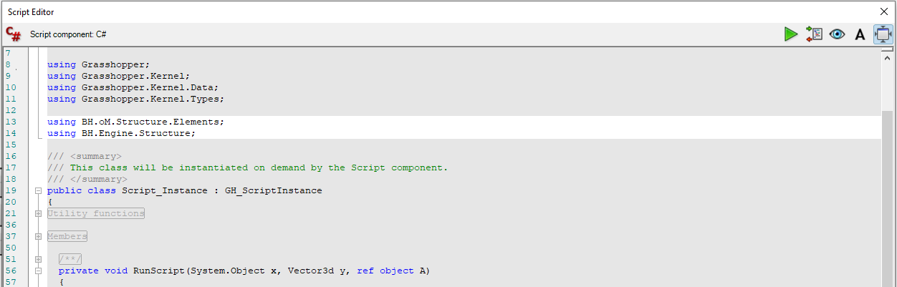
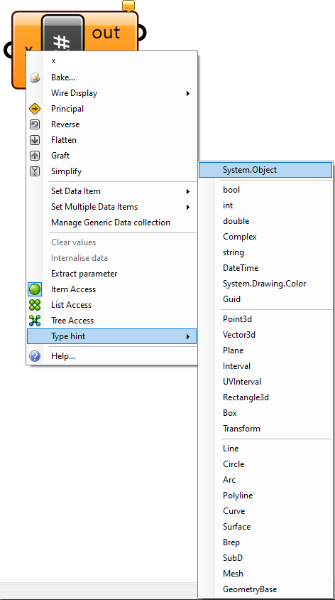
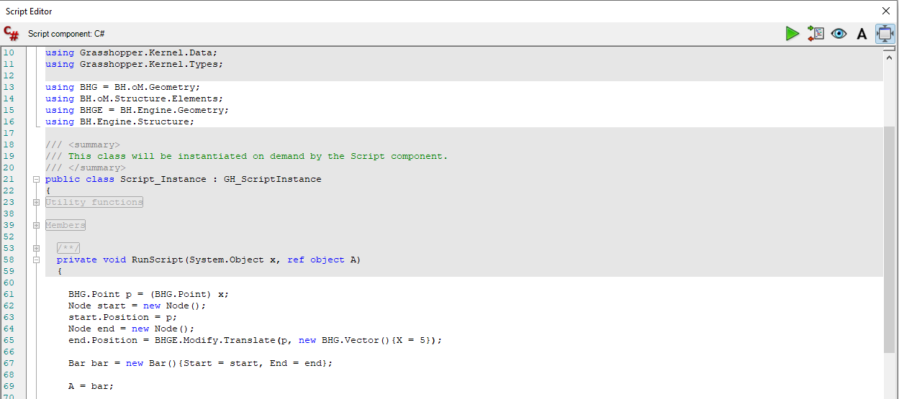

# Coding BHoM in a Grasshopper CSharp script component

BHoM can be referenced and used in a Grasshopper "C# Script" component. The only additional requirement as of the current version is to also reference `netstandard.dll` in the same Grasshopper component.

## Find the .NET Standard assembly dll file

Currently, a reference to the .NET Standard assembly is required to use BHoM from a C# script component in Grasshopper. 

### Download (or find on your drive) the .NET Standard assembly

You can download the right version of `netstandard.dll` (currently, 2.0.3 is the one used in BHoM) from [here](https://www.nuget.org/packages/NETStandard.Library):
1. Click on "download package".
2. Open the downloaded `.npckg` file with a Zip archiver like 7zip.
3. Go in the folder `build/netstandard2.0/ref/` and you will find `netstandard.dll`.
4. Place the `netstandard.dll` somewhere in your C: drive where you will be able to find it, and remember that location. You could place it in the BHoM installation directory (normally `C:\ProgramData\BHoM\`), but be aware that if you reinstall or update BHoM it will get deleted.

!!! note

    If you downloaded `netstandard.dll` previously but you can't remember where you placed it, you can search for a copy of `netstandard.dll` in your disk. 
    ⚠️ _However_, there could be multiple copies/versions of a `netstandard.dll` file on your drive. If you find multiple files called `netstandard.dll`, then it's better to re-download it from the link above to make sure you are using the right version. ⚠️
    
    Search for `netstandard.dll` in Explorer from your C: drive:
    
    

    Once found, get its location by right-clicking on it and doing "Open location", then copy the location in Explorer. Take note of it.
    
    

## Reference the assemblies in the C# Script component

To start coding let's create a "C# Script" component in Grasshopper where we will reference the required DLLs.

1. Drop a "C# Script" component in the canvas.
2. Right click it, do "Manage Assemblies". A window will pop up.
3. Click "Add". A File Explorer window will pop up.
4. Add a reference to the `netstandard.dll` file, found as explained above. Select it and do "Open". You will see that it appears in the Referenced Assemblies section.
5. Click "Add" again. Navigate to the BHoM assemblies directory (normally `C:\ProgramData\BHoM\Assemblies`). There you will find all BHoM DLLs. As a minimum, we will want to include `BHoM.dll` and `BHoM_Engine.dll`. We can add as many as we need, but don't add them all together. You will come back to add more in case the script complains that some are missing.



    

## Start scripting!

Let's make an example where we want to create a `BH.oM.Geometry.Point` object in the script. To do so, we need to add another 2 references, `Geometry_oM.dll` and `Dimensional_oM.dll`. Let's do that as explained above. We will end up having the following:



Next, let's open the script and write:
```cs

BH.oM.Geometry.Point p = new BH.oM.Geometry.Point();
p.X = 3;
p.Y = 5;
p.Z = 1;

A = p;
```

You will have this:



Press OK, and voila, a BHoM point is created! You can also check its values with the `Explode` component:


### Script with more complex objects

Do the same for any other BHoM object you may want to create. Using more complex objects will require to add more references, like explained in the previous section. For example, if we want to create a structural node with this point, we can do:

```cs
BH.oM.Geometry.Point p = new BH.oM.Geometry.Point();
p.X = 3;
p.Y = 5;
p.Z = 1;

BH.oM.Structure.Elements.Node node = new BH.oM.Structure.Elements.Node();
node.Position = p;

A = p;
```

However, if you press OK, you will be met with an error like:



This simply means that you need to add references to `Structure_oM.dll`. If we add that and try again, the error will still not go away, but will be different:


This is because the `Structure_oM.dll` itself depends on `Analytical_oM.dll`.  
By adding this last dependency the error will go away.

### Simplfying namespaces

For complex C# script components where multiple object types are used, it can be cumbersome to type `BH.oM.Geometry.Node` everytime you want to create a `Node`. 

On L13 of the C# component you can add references to specific namespaces:



!!! note

    You need to be mindful that the BHoM object types do not clash with the Rhino object types. For example, on L13 `using BH.oM.Geometry` and trying to use a `Point` object will return an error.
	
	That is because on L6 there is a reference to `Rhino.Geometry` and the component cannot distinguish between a Rhino.Geometry.Point and a BH.oM.Geometry.Point.
	
	A workaround to this is to shortern the namespace. For example, `using BHG = BH.oM.Geometry` will allow you to use `BHG.Point` without causing an ambiguity error with a `Rhino.Geometry.Point`.
	
### Using BHoM objects as inputs

If you want to use a BHoM object as an input for the C# component, you need to first change the type hint to `System.Object`:



When you use the object in the script, you need to first cast it to a BHoM object. Then you can use the object as you would in any other IDE:



